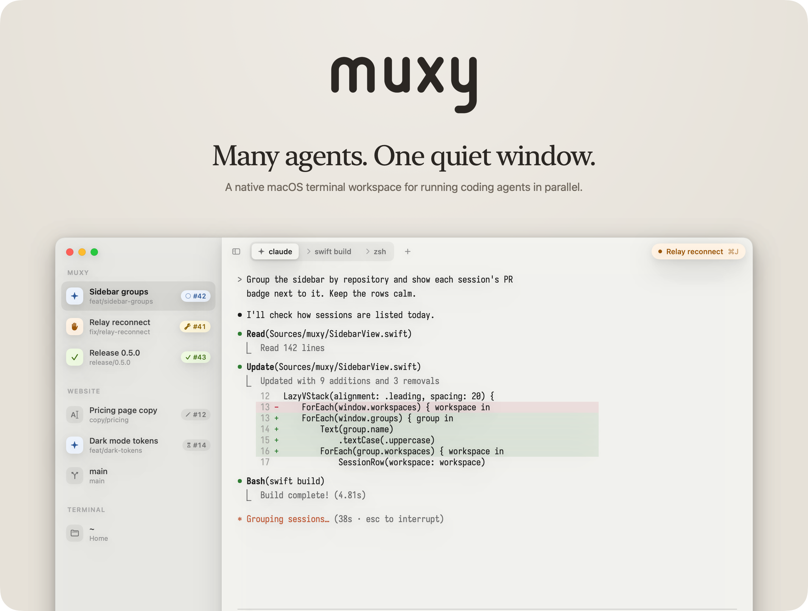
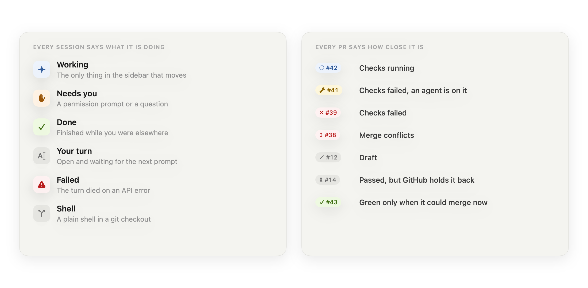
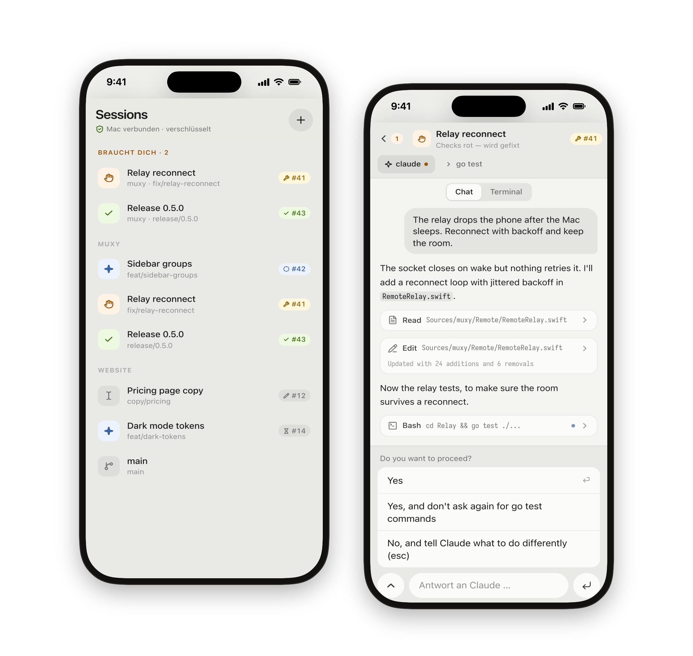

<p align="center">
  <picture>
    <source media="(prefers-color-scheme: dark)" srcset=".github/readme/poster-dark.png">
    
  </picture>
</p>

<p align="center">
  Real Ghostty rendering, every session in one window,<br>
  and a calm signal the moment one of them needs you.
</p>

<p align="center">
  <a href="#install"><b>Install</b></a>&nbsp;&nbsp;·&nbsp;&nbsp;<a href="https://github.com/theitger/muxy/releases/latest">Download</a>&nbsp;&nbsp;·&nbsp;&nbsp;<a href="#on-your-phone">On your phone</a>&nbsp;&nbsp;·&nbsp;&nbsp;<a href="#keys">Keys</a>
  <br>
  <sub>macOS 14 or later&nbsp;&nbsp;·&nbsp;&nbsp;MIT licensed</sub>
</p>

<br>

## It is your Ghostty

Muxy embeds [libghostty](https://ghostty.org) and loads your own
`~/.config/ghostty/config`: theme, font, opacity, padding, all of it,
1:1. The sidebar and tab bar take their colors from your theme, so the
window reads as one terminal instead of a frame around one. Light and dark
follow the system.

## A session is what used to be a window

`⌘N` opens one. `cd` somewhere and start your agent; `⌘T` opens a tab
right there. The sidebar groups sessions by repository and shows branch
and pull request on its own. Nothing to configure.

Drag a session out of the sidebar and drop it anywhere: it becomes its own
window, right there. Drop it on another window's sidebar and it moves in.
Running processes don't notice.

## Know which agent needs you

<picture>
  <source media="(prefers-color-scheme: dark)" srcset=".github/readme/signals-dark.png">
  
</picture>

A Claude Code hook reports *working*, *done* and *needs you* for every tab.
The session's tile changes, the Dock shows a count, and when Muxy is in
the background a banner appears; click it and you're in that session. `⌘J`
jumps to the next one waiting, from any window.

The PR badge follows the CI checks and GitHub's merge state: blue while
checks run, yellow when they failed and something in the session is
working on it, red when they failed or the PR has conflicts, grey for
drafts and PRs GitHub still holds back (review, out-of-date branch,
required check missing). Green only when it could be merged right now.

## On your phone

<picture>
  <source media="(prefers-color-scheme: dark)" srcset=".github/readme/phone-dark.png">
  
</picture>

Settings → Phone shows a QR code. Scan it and Safari becomes a remote for
every session: the sidebar with agent states and PR badges, Claude as a
chat with permission buttons, any tab's screen with a line to type into and
the keys a phone lacks. It works on the same Wi-Fi, or from anywhere
through your own relay (`Relay/`, a small server Muxy connects out to).
The phone app speaks German for now.

Pairing puts a secret on the phone, and every connection is end-to-end
encrypted with it (fresh X25519 keys, ChaCha20-Poly1305). "Pair Again"
locks all phones out.

## The quiet details

- **Keeps the Mac awake.** Optional, in Settings: while Muxy runs the Mac
  doesn't sleep, lid closed included, so agents keep working and the phone
  keeps reaching them. Asks for your password once. Quitting Muxy, or
  Muxy dying, turns it off; below 20 % battery the Mac may sleep again.
- **Built to stay fast.** Exactly one terminal surface per window is
  attached; background sessions keep their PTY but cost no rendering. No
  animations while idle.
- **English or German.** English by default; switch in Settings (`⌘,`).

## Install

```sh
brew tap theitger/tap
brew trust theitger/tap        # Homebrew ≥ 6 requires tap trust
brew install --cask muxy
```

The app is ad-hoc signed (no Apple Developer certificate), so the cask
clears the quarantine flag after installing; otherwise Gatekeeper would
block the first launch as "unverified developer". Installing the zip by
hand instead needs `xattr -dr com.apple.quarantine /Applications/Muxy.app`.

<details>
<summary><b>Build from source</b></summary>
<br>

```sh
git clone https://github.com/theitger/muxy && cd muxy
./Scripts/make-app.sh   # fetches the pinned GhosttyKit binary, builds ~/Applications/Muxy.app
```

Requires macOS 14+, Xcode 15+ command line tools. If Ghostty.app is
installed, its shell integration and terminfo are bundled into Muxy.

</details>

## Setup

1. **Agent status:** `./Scripts/install-claude-hook.sh` and
   `./Scripts/install-codex-hook.sh` add Muxy's hooks to Claude Code and
   Codex. They are a no-op outside Muxy and leave other hooks untouched;
   rerun them after updating Muxy. Codex runs a new hook only once you
   trust it: type `/hooks` in codex once. The hooks also tell Muxy each
   conversation's id, so sessions come back after a restart.
2. **Worktrees** (optional): a `.wtconfig` in a repository tells Muxy how
   a new worktree becomes ready to work in: ignored files to copy, ports
   of its own, its own Compose project, a bootstrap command, a teardown.
   See `Sources/muxy/Worktrees.swift`. Muxy keeps one such worktree ready
   per repository, so a new session starts at once.
3. **`muxy` on your PATH** (optional):
   `ln -s "$PWD/Scripts/muxy" ~/.local/bin/muxy`, then `muxy .` opens a
   session in the current directory. Folders dropped on the Dock icon do the
   same.

## Keys

| Key | Action |
| --- | --- |
| `⌘N` | new session: task, repository, agent, own worktree |
| `⌥⌘N` | new shell in home |
| `⇧⌘N` | new window |
| `⌘T` | new tab in the current tab's directory |
| `⌘W` | close tab → the last tab closes the session → an empty window closes |
| `⌘1…9` · `⌃Tab` | switch tab |
| `⌃1…9` · `⌘⌥↑/↓` | switch session |
| `⌘J` | next session that wants you (any window) |
| `⌘K` | search sessions |
| `⌘B` | show/hide the sidebar (drag its edge to resize) |

Closing a window ends its sessions (confirmed if something runs); `⌘Q`
confirms too. Muxy keeps running without windows: click the Dock icon.

## Under the hood

- SwiftUI + AppKit shell around `libghostty` (via
  [libghostty-spm](https://github.com/Lakr233/libghostty-spm), vendored and
  pinned under `Vendor/` with two small patches marked `muxy patch`; the
  ~50 MB GhosttyKit binary is fetched at build time, checksum-verified).
- Ghostty's exec backend spawns your login shell per tab: real PTY, real
  VT, no custom terminal code in this repo.
- The working directory (OSC 7) and command exit codes (OSC 133) come from
  the shell; repository, branch, PR and its checks are derived from them with
  `git` and `gh` (checks re-polled every minute).
- Chrome colors are parsed from your Ghostty theme files at launch and
  derived programmatically, so the UI always matches the terminal.

## Credits & license

MIT © Tristan Heitger. Muxy stands on
[Ghostty](https://ghostty.org) by Mitchell Hashimoto (MIT) and
[libghostty-spm](https://github.com/Lakr233/libghostty-spm) by
[@Lakr233](https://github.com/Lakr233) (MIT, license included under
`Vendor/`). Not affiliated with the Ghostty project.

<br>

<p align="center">
  <picture>
    <source media="(prefers-color-scheme: dark)" srcset=".github/readme/icon-dark.png">
    
  </picture>
</p>
